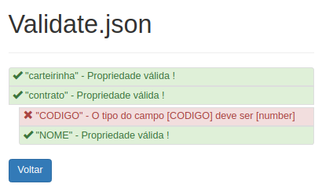

# Validate.json
Validador de estruturas json

Site: [https://igorferrani.github.io/Validate.json/](https://igorferrani.github.io/Validate.json/)

## Estrutura base
A estrutura base para validação deve ser um mock em json

``` bash
{
    ...
    "carteirinha": null,
    "contrato": [
        {
            "CODIGO": "10032214",
            "NOME": "10032214"
        }
    ]
    ...
}
```

## Estrutura de entrada

``` bash
{
    ...
    "carteirinha": null,
    "contrato": [
        {
            "CODIGO": "10032214",
            "NOME": "10032214"
        }
    ]
    ...
}
```

A saida da validação acima será:

